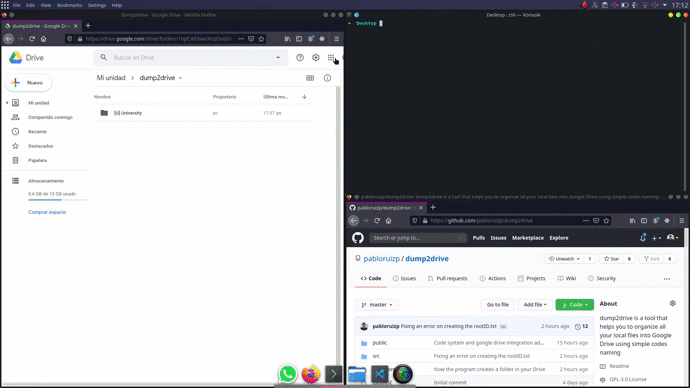

# dump2drive
&nbsp;&nbsp;&nbsp;&nbsp;&nbsp;&nbsp;


dump2drive is a tool that helps you to organize all your local files into Google Drive using simple codes naming  



## Prerequisites
* [Node.js & npm](https://nodejs.org/es/)
* A Google account with Google Drive enabled        

## Installation
The installation process is still under development. It will be improved for all platforms in the future.
### Linux
```
cd ~
git clone http://github.com/pabloruizp/dump2drive.git
cd dump2drive
./install.sh
```

### Windows 
```
git clone http://github.com/pabloruizp/dump2drive.git
cd dump2drive
mkdir files
npm install
```
On the Windows installation, the program won't be added to the $PATH
### Turn on the Google Drive API 
The easiest way to generate the API credentials is going to the [Node.js Quickstart](https://developers.google.com/drive/api/v3/quickstart/nodejs) and follow the **Step 1**. Make sure that you *Configure the OAuth client* as a **Desktop app**.  

Once you get the credentials.json file, store it into the dump2drive folder.  

## Code System
All the tool is based on a code system. The code **MUST** be added between [ ]
### Folders
The idea is to add a code at the begining of your Drive folders. The code should be short and easy to remember. **All folders** must be inside a folder called **dump2drive** that has been created the first time you execute the program.
### Files
The local files will also have a code. This code must be a code composition of the Drive directories.
### Example
Imagine that you have the following directory structure on your Drive
```
`-- [U] University
    |-- [M1] Maths 1
    |   `-- [U1] Unit 1
    `-- [P1] Programming 1
```
If you want to store a file on the **Programming 1** folder, the name of the file must be **[UP1]** filename.  
If you want to store a file on the **Unit 1** folder, the name of the file must be **[UM1U1]** filename.

## Usage
### Linux
If you have followed the installation process. You just have to type on a terminal:
```
dump2drive
```
And dump2drive will be working

### Windows
On Windows is trickier. You have to move into the dump2drive folder and once you are there
```
npm start --silent
```  

Once the program is running you can go to [http://localhost:3000](http://localhost:3000) and start uploading your local files.
